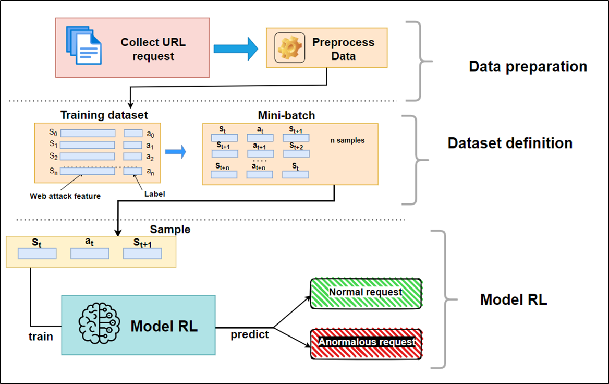

## Introduction 
### A NOVEL WEB ATTACK DETECTION MODEL BASED ON REINFORCEMENT


Detect web attack using RL

Hi, I'm Hai Ha - 4th year student in Infomation Technology with major in Infomation Security. 
## Structure

```
.
├── code-test (code evaluate DL)
│   └── model_DL (model DL after train)
├── data (data use for model RL)
│   ├── matrix1
│   ├── matrix2
│   ├── matrix3
│   ├── matrix4
│   └── matrix5 (final data)
│       ├── normal (dataset for RL)
│       ├── origin
│       └── temp
├── demo (code train/test model RL)
│   ├── model-x-x (model RL train at x/x)
│   └── model-OK (final model)
├── images 
├── new_data (data original)
│   ├── anomalous
│   │   ├── ECML-PKDD-2007
│   │   ├── fwaf
│   │   ├── HTTP_DATASET_CSIC_2010
│   │   └── HttpParamsDataset-master
│   └── normal
│       ├── ECML-PKDD-2007
│       ├── fwaf
│       ├── HTTP_DATASET_CSIC_2010
│       └── HttpParamsDataset-master
└── process_Data (code preprocess dataset and train DL)
    └── create_new_dataset (code create new dataset for RL)
```

Link result test model RL: https://www.youtube.com/watch?v=rw0VSBjCE-E

Hai Ha - 30.06.2023
